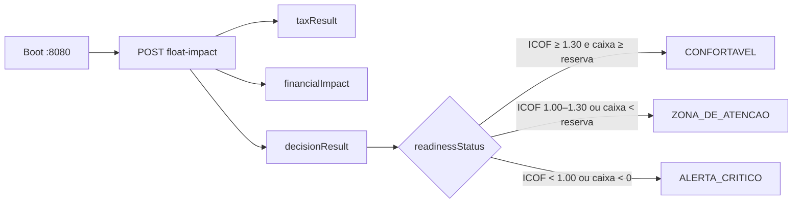

# Split Payment Simulation API · V1.0

<p align="center">
  <strong>Quick Start Guide</strong><br/>
  <em>Synchronous Sandbox · Zero Auth · Local-first</em>
</p>

<p align="center">
  <code>POST /api/v1/simulations/float-impact</code>
  &nbsp;·&nbsp;
  <code>http://localhost:8080</code>
  &nbsp;·&nbsp;
  <code>Release 1.0</code>
</p>

---

> **O que você vai fazer em ~5 minutos**
>
> 1. Subir a API localmente  
> 2. Enviar 3 payloads que disparam decisões diferentes  
> 3. Ler `cashGap`, reajuste de preço e o veredito de risco  

---

## Journey map

```text
┌─────────────┐    ┌──────────────┐    ┌──────────────┐    ┌─────────────┐
│  01 · BOOT  │───▶│ 02 · CONTRACT│───▶│ 03 · SIMULATE│───▶│ 04 · READ   │
│  Subir API  │    │ Regras ouro  │    │ 3 cenários   │    │ Resposta    │
└─────────────┘    └──────────────┘    └──────────────┘    └─────────────┘
```



---

## 01 · Boot — subir a API

<table>
  <tr>
    <td width="50%" valign="top">

### Opção A · Docker Compose

Ideal para uso isolado, espelhando produção.

```bash
cp .env.example .env
docker compose up --build
```

    </td>
    <td width="50%" valign="top">

### Opção B · Maven

Ideal para desenvolvimento e debug.

```bash
mvn -B -ntp spring-boot:run
```

    </td>
  </tr>
</table>

> **Status esperado**  
> Tomcat em `8080` · profile local · **sem autenticação** na V1.0.

**Smoke test (opcional):** se a porta responder a um `POST`, você está pronto para o Step 02.

---

## 02 · Contract — regras de ouro

Estas regras são **inegociáveis**. Payload inválido = `400 VAL-*`.

| Regra | Correto | Errado |
| ---: | :--- | :--- |
| Decimais como **string** | `"10000.00"` | `10000.00` |
| Separador **ponto** | `"0.28"` | `"0,28"` |
| Datas **ISO-8601** | `"2026-07-23"` | `"23/07/2026"` |
| Percentuais **0–1** | `"0.28"` = 28% | `"28"` |
| `dayCountBasis` | `30` · `360` · `365` | outros |
| `fundingRatePeriod` | `"DAY"` · `"MONTH"` · `"YEAR"` | outros |

> **Header obrigatório**  
> `Content-Type: application/json`

---

## 03 · Simulate — testando os 3 cenários de risco

### Matriz do Decision Engine

| Status | Quando dispara | Risco |
| :--- | :--- | :---: |
| `CONFORTAVEL` | ICOF ≥ **1,30** **e** saldo mínimo ≥ reserva | `BAIXO` |
| `ZONA_DE_ATENCAO` | Não crítico **e** (ICOF &lt; **1,30** **ou** saldo &lt; reserva) | `MEDIO` |
| `ALERTA_CRITICO` | ICOF &lt; **1,00** **ou** saldo mínimo split &lt; **0** | `ALTO` |

Os três `curl` abaixo foram validados contra a API local. Copie, cole e compare o `decisionResult`.

---

### Card A · CONFORTAVEL

<table>
  <tr>
    <td>

**Cenário** `quickstart-confortavel`  
**Status esperado** `CONFORTAVEL` · `BAIXO`  
**Setup** caixa alto · custo fixo baixo · saldo acima da reserva

    </td>
  </tr>
</table>

```bash
curl -s -X POST http://localhost:8080/api/v1/simulations/float-impact \
  -H "Content-Type: application/json" \
  -d '{
    "scenarioId": "quickstart-confortavel",
    "referenceDate": "2026-07-23",
    "rulesetVersion": "v1.0.0-EC132",
    "operations": [
      {
        "operationId": "op-1",
        "taxPolicyReference": "LC214/2025-Art31",
        "taxableBase": "10000.00",
        "effectiveTaxRate": "0.28",
        "alreadyExtinguishedTaxAmount": "0.00",
        "splitEligiblePercentage": "1.00",
        "settlementDate": "2026-01-01",
        "baselineTaxDueDate": "2026-01-01",
        "fixedCostCashOutflow": "500.00",
        "variableCostCashOutflow": "0.00",
        "netRevenues": "8000.00",
        "revenueAdjustableAmount": "8000.00"
      }
    ],
    "financialScenario": {
      "fundingRate": "0.00",
      "fundingRatePeriod": "YEAR",
      "dayCountBasis": 365,
      "initialAvailableCash": "5000.00",
      "minimumCashReserve": "500.00",
      "incrementalVariableCostPercentage": "0.10",
      "incrementalPaymentFeePercentage": "0.05",
      "incrementalCommissionPercentage": "0.05"
    }
  }'
```

<details>
<summary><strong>Painel de resultado · Cenário A</strong></summary>

| Métrica | Valor |
| :--- | ---: |
| ICOF liquidez | `25.0000` |
| Saldo mínimo Split | `5000.0000` |
| Cash Gap | `0.0000` |
| Reajuste estimado | `0.0000` (0%) |
| `readinessStatus` | `CONFORTAVEL` |
| `riskLevel` | `BAIXO` |

**Por quê o motor decidiu assim?**  
ICOF = 25 (≥ 1,30) e o menor saldo Split (5.000) ≥ reserva (500). Sem gap — nenhuma pressão de precificação.

</details>

---

### Card B · ZONA_DE_ATENCAO

<table>
  <tr>
    <td>

**Cenário** `quickstart-atencao`  
**Status esperado** `ZONA_DE_ATENCAO` · `MEDIO`  
**Setup** custo fixo alto · reserva agressiva · caixa ainda positivo

    </td>
  </tr>
</table>

```bash
curl -s -X POST http://localhost:8080/api/v1/simulations/float-impact \
  -H "Content-Type: application/json" \
  -d '{
    "scenarioId": "quickstart-atencao",
    "referenceDate": "2026-07-23",
    "rulesetVersion": "v1.0.0-EC132",
    "operations": [
      {
        "operationId": "op-1",
        "taxPolicyReference": "LC214/2025-Art31",
        "taxableBase": "10000.00",
        "effectiveTaxRate": "0.28",
        "alreadyExtinguishedTaxAmount": "0.00",
        "splitEligiblePercentage": "1.00",
        "settlementDate": "2026-01-01",
        "baselineTaxDueDate": "2026-01-01",
        "fixedCostCashOutflow": "5000.00",
        "variableCostCashOutflow": "0.00",
        "netRevenues": "3000.00",
        "revenueAdjustableAmount": "3000.00"
      }
    ],
    "financialScenario": {
      "fundingRate": "0.00",
      "fundingRatePeriod": "YEAR",
      "dayCountBasis": 365,
      "initialAvailableCash": "5000.00",
      "minimumCashReserve": "2000.00",
      "incrementalVariableCostPercentage": "0.10",
      "incrementalPaymentFeePercentage": "0.05",
      "incrementalCommissionPercentage": "0.05"
    }
  }'
```

<details>
<summary><strong>Painel de resultado · Cenário B</strong></summary>

| Métrica | Valor |
| :--- | ---: |
| ICOF liquidez | `1.2000` |
| Saldo mínimo Split | `200.0000` |
| Cash Gap | `1800.0000` |
| Reajuste estimado | `0.7500` (**75%**) |
| `readinessStatus` | `ZONA_DE_ATENCAO` |
| `riskLevel` | `MEDIO` |

**Por quê o motor decidiu assim?**  
Não há ruptura (saldo ≥ 0) e ICOF ≥ 1,00 — então não é crítico. Porém ICOF = 1,20 (&lt; 1,30) **e** saldo (200) &lt; reserva (2.000). Duplo gatilho de atenção; o motor sugere ~75% de reajuste para fechar o gap.

</details>

---

### Card C · ALERTA_CRITICO

<table>
  <tr>
    <td>

**Cenário** `quickstart-critico`  
**Status esperado** `ALERTA_CRITICO` · `ALTO`  
**Setup** caixa baixo · retenção do Split no settlement · saldo negativo

    </td>
  </tr>
</table>

```bash
curl -s -X POST http://localhost:8080/api/v1/simulations/float-impact \
  -H "Content-Type: application/json" \
  -d '{
    "scenarioId": "quickstart-critico",
    "referenceDate": "2026-07-23",
    "rulesetVersion": "v1.0.0-EC132",
    "operations": [
      {
        "operationId": "op-1",
        "taxPolicyReference": "LC214/2025-Art31",
        "taxableBase": "10000.00",
        "effectiveTaxRate": "0.28",
        "alreadyExtinguishedTaxAmount": "0.00",
        "splitEligiblePercentage": "1.00",
        "settlementDate": "2026-01-01",
        "baselineTaxDueDate": "2026-01-03",
        "fixedCostCashOutflow": "500.00",
        "variableCostCashOutflow": "0.00",
        "netRevenues": "2000.00",
        "revenueAdjustableAmount": "3000.00"
      }
    ],
    "financialScenario": {
      "fundingRate": "0.00",
      "fundingRatePeriod": "YEAR",
      "dayCountBasis": 365,
      "initialAvailableCash": "100.00",
      "minimumCashReserve": "100.00",
      "incrementalVariableCostPercentage": "0.10",
      "incrementalPaymentFeePercentage": "0.05",
      "incrementalCommissionPercentage": "0.05"
    }
  }'
```

<details>
<summary><strong>Painel de resultado · Cenário C</strong></summary>

| Métrica | Valor |
| :--- | ---: |
| ICOF liquidez | `4.0000` |
| Saldo mínimo Split | `-1200.0000` |
| Cash Gap | `1300.0000` |
| Reajuste estimado | `0.5417` (**54,17%**) |
| `readinessStatus` | `ALERTA_CRITICO` |
| `riskLevel` | `ALTO` |

**Por quê o motor decidiu assim?**  
Mesmo com ICOF saudável (4,00), o saldo mínimo Split cai para **-1.200**. Qualquer ruptura (`C_min < 0`) força `ALERTA_CRITICO`. Gap = 1.300; reajuste estimado ≈ 54,17%.

</details>

---

### Comparativo lado a lado

| | A · Confortável | B · Atenção | C · Crítico |
| :--- | :---: | :---: | :---: |
| `initialAvailableCash` | `5000.00` | `5000.00` | `100.00` |
| `minimumCashReserve` | `500.00` | `2000.00` | `100.00` |
| `fixedCostCashOutflow` | `500.00` | `5000.00` | `500.00` |
| ICOF liquidez | `25.0000` | `1.2000` | `4.0000` |
| Saldo mín. Split | `5000.0000` | `200.0000` | `-1200.0000` |
| Cash Gap | `0.0000` | `1800.0000` | `1300.0000` |
| Reajuste | `0%` | `75%` | `54,17%` |
| **Status** | `CONFORTAVEL` | `ZONA_DE_ATENCAO` | `ALERTA_CRITICO` |

---

## 04 · Read — como ler a resposta

Pense na resposta como um **dashboard de 3 painéis**:

```text
┌──────────────────┐  ┌──────────────────────┐  ┌──────────────────┐
│   taxResult      │  │  financialImpact     │  │ decisionResult   │
│   Quanto retém   │  │  Onde está a liquidez│  │  O veredito      │
└──────────────────┘  └──────────────────────┘  └──────────────────┘
```

### Painel `taxResult` — retenção do Split

```json
"taxResult": {
  "grossTaxDebit": "2800.0000",
  "splitEligibleAmount": "2800.0000",
  "simulatedSplitWithheldAmount": "2800.0000"
}
```

Débito bruto × elegibilidade = valor retido na liquidação  
(exemplo: `10000.00` × `0.28` → `2800.0000`).

### Painel `financialImpact` — liquidez e precificação

| Campo | O que olhar |
| :--- | :--- |
| `liquidityFixedObligationCoverageIndex` | ICOF de liquidez (entrada da matriz) |
| `minimumSplitProjectedCashBalance` | Pior saldo no cenário Split |
| `cashGap` | Quanto falta para cobrir a reserva no pior dia |
| `estimatedPriceAdjustmentPercentage` | Repasse mínimo sugerido — fração (`0.5417` = **54,17%**) |

### Painel `decisionResult` — veredito

```json
"decisionResult": {
  "readinessStatus": "ALERTA_CRITICO",
  "riskLevel": "ALTO",
  "analyticalMessage": "ICOF de liquidez saudável, mas ruptura de caixa projetada no cenário split."
}
```

**Fluxo de leitura recomendado**

1. Abra `decisionResult.readinessStatus`  
2. Se não for `CONFORTAVEL`, vá em `financialImpact.cashGap` e `estimatedPriceAdjustmentPercentage`  
3. Use `analyticalMessage` para saber se o gatilho foi ICOF, reserva ou ruptura de caixa  

---

## Ferramenta rápida · extrair só o que importa

Salve um payload em `payload.json` e rode:

```bash
curl -s -X POST http://localhost:8080/api/v1/simulations/float-impact \
  -H "Content-Type: application/json" \
  -d @payload.json \
  | grep -oE '"(cashGap|estimatedPriceAdjustmentPercentage|readinessStatus|riskLevel|analyticalMessage)":"[^"]*"'
```

Saída típica (Cenário C):

```text
"cashGap":"1300.0000"
"estimatedPriceAdjustmentPercentage":"0.5417"
"readinessStatus":"ALERTA_CRITICO"
"riskLevel":"ALTO"
"analyticalMessage":"ICOF de liquidez saudável, mas ruptura de caixa projetada no cenário split."
```

---

## Erros comuns · troubleshooting

| HTTP | Código | Sintoma | Ação |
| :---: | :---: | :--- | :--- |
| `400` | `VAL-001` | Campo inválido / ausente | Conferir strings, datas e ranges |
| `400` | `VAL-002` | Payload rejeitado pela ACL | Revisar conversão decimal |
| `400` | `VAL-003` | JSON malformado ou tipo errado | Enviar decimais como **string** |
| `422` | `FIN-001` | Custo fixo agregado = 0 | Informe `fixedCostCashOutflow` &gt; 0 |
| `422` | `FIN-002` | Gap existe, mas receita ajustável = 0 | Informe `revenueAdjustableAmount` |
| `422` | `FIN-003` | Modelo de precificação inviável | Revise margens incrementais |

---

## Disclaimer

> Resultados desta API são **simulações parametrizadas**.  
> Não constituem cálculo fiscal oficial, declaração de conformidade nem aconselhamento jurídico, contábil ou tributário.  
> Valide com profissionais qualificados antes de decisões financeiras ou fiscais.

---

<p align="center">
  <strong>Próximos passos</strong><br/>
  <a href="ARCHITECTURE.md">ARCHITECTURE.md</a> ·
  <a href="RELEASE_NOTES.md">RELEASE_NOTES.md</a> ·
  <a href="VISION.md">VISION.md</a> ·
  <a href="docs/backlogs/SPRINT_BACKLOG.md">Sprint Backlog V2</a>
</p>

<p align="center">
  <sub>Cash Flow Impact Simulation Engine · Apache License 2.0</sub>
</p>
