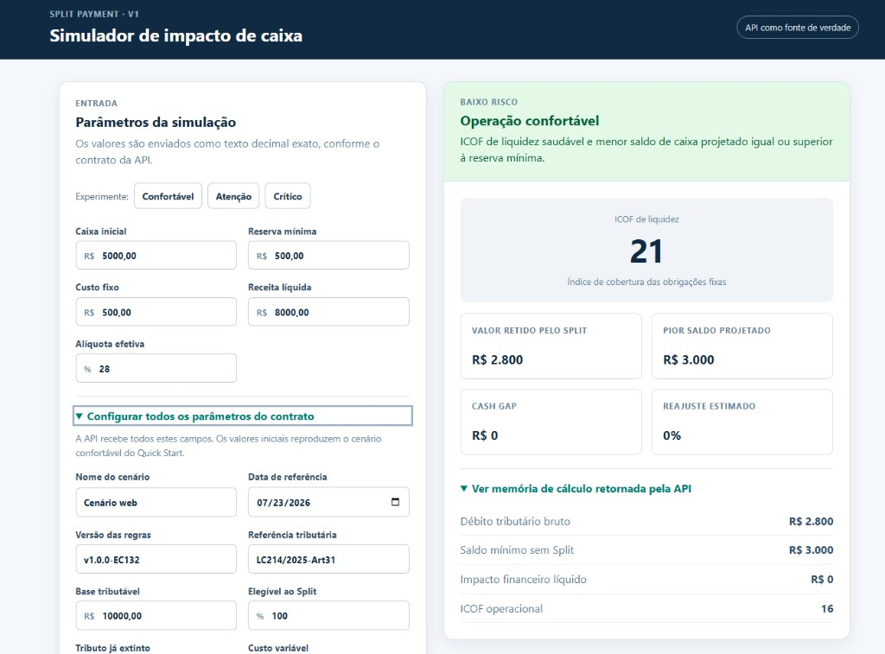

# Cash Flow Impact Simulation Engine

[](https://github.com/rodrigochavesoa/split-payment-simulation/actions/workflows/ci.yml)
[](https://openjdk.org/)
[](https://spring.io/projects/spring-boot)

Simulador determinístico de impacto de caixa para cenários de Split Payment. A aplicação calcula eventos tributários parametrizados, perda do float, cobertura de obrigações fixas, projeções de caixa, gap de liquidez, reajuste estimado de preço e classificação de risco.

## Quick Start (V1.0)

**Entenda e teste a API em menos de 5 minutos rodando 3 cenários práticos de risco.**

**[Abrir o Guia de Início Rápido da V1.0](QUICKSTART_V1.md)** — suba a API, execute os `cURL`s e compare os resultados `CONFORTAVEL`, `ZONA_DE_ATENCAO` e `ALERTA_CRITICO`.

## Dashboard web (V1.0)

Interface React + TypeScript que consome a API real — **sem recalcular fórmulas no navegador**. Os presets `Confortável`, `Atenção` e `Crítico` preenchem o formulário; o veredito (`readinessStatus`), `cashGap` e reajuste vêm sempre do motor Java.



### Ativar o dashboard (dependências já instaladas)

1. **Terminal 1 — API Spring** (raiz do repositório):

   ```bash
   mvn -B -ntp spring-boot:run
   ```

   Aguarde a API em `http://localhost:8080`.

2. **Terminal 2 — dashboard Vite**:

   ```bash
   cd frontend
   cp -n .env.example .env.local   # só na primeira vez
   npm run dev
   ```

3. Abra **`http://localhost:5173`**, escolha um preset (`Confortável`, `Atenção` ou `Crítico`) e clique em **Simular impacto**.

Documentação técnica do frontend: [frontend/README.md](frontend/README.md). Instalação de Node/Java/Maven: `./scripts/verify-dev-env.sh`.

## Aviso importante

Os resultados produzidos por este projeto são simulações baseadas nos parâmetros, regras e versões de regras informados pelo usuário. Eles não constituem cálculo fiscal oficial, declaração de conformidade, aconselhamento jurídico, contábil ou tributário, nem garantia de que uma operação atende à legislação aplicável. Antes de tomar decisões financeiras, fiscais ou operacionais, os resultados devem ser revisados e validados por profissionais qualificados, considerando a legislação e as orientações oficiais vigentes.

## Stack

- Java 21 e Spring Boot 3
- Maven
- `BigDecimal` com `HALF_EVEN`
- JUnit 5, MockMvc e TestRestTemplate
- Docker multi-stage e GitHub Actions

## Início rápido

```bash
mvn -B -ntp verify
cp .env.example .env
docker compose up --build
```

A API é exposta em `http://localhost:8080`. Valores monetários e percentuais devem ser enviados como strings decimais com ponto, nunca como `float` ou `double` JSON.

Para um fluxo prático com 3 cenários de risco (`CONFORTAVEL`, `ZONA_DE_ATENCAO`, `ALERTA_CRITICO`), veja o [Quick Start Guide V1.0](QUICKSTART_V1.md).

## Arquitetura e regras

O fluxo é `API -> ACL -> Tax Engine -> Finance Engine -> Decision Engine`. Consulte:

- [QUICKSTART_V1.md](QUICKSTART_V1.md): guia prático de uso da API Sandbox V1.0.
- [frontend/README.md](frontend/README.md): dashboard web V1.0 (React + Vite).
- [VISION.md](VISION.md): visão do produto, escopo da V1.0 e evolução planejada para a V2.0.
- [ARCHITECTURE.md](ARCHITECTURE.md): arquitetura, fórmulas, matriz de decisão e catálogo de erros.
- [RELEASE_NOTES.md](RELEASE_NOTES.md): escopo e limitações da Release 1.0.
- [CONTRIBUTING.md](CONTRIBUTING.md): padrão de contribuição e testes obrigatórios.
- [SECURITY.md](SECURITY.md): reporte responsável de vulnerabilidades.

## Qualidade e segurança

Pull requests para `main` executam build, testes, Checkstyle, OWASP Dependency-Check e CodeQL. O Golden Case protege os resultados financeiros de regressões silenciosas.

## Licença

Este projeto é distribuído sob a [Apache License 2.0](LICENSE). Consulte o arquivo `LICENSE` para os termos completos.
