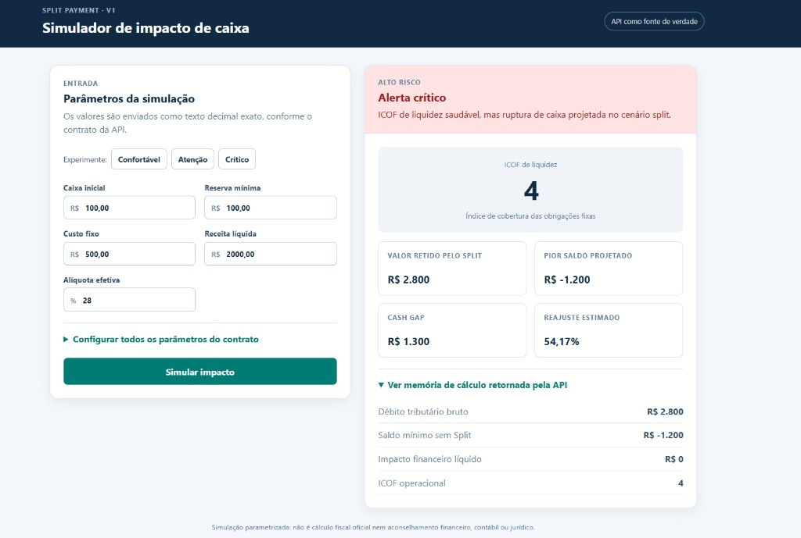

# Dashboard do Simulador

Interface React + TypeScript independente do serviço Spring. Ela não reproduz fórmulas financeiras: monta o contrato V1 e apenas apresenta a resposta devolvida pelo motor.

<p align="center">
  
</p>

<p align="center"><em>Cenário Crítico — alerta de ruptura de caixa, Cash Gap R$ 1.300 e reajuste estimado 54,17%.</em></p>

## Ativar o dashboard (dependências já instaladas)

1. **Terminal 1 — API** (raiz do repositório):

   ```bash
   mvn -B -ntp spring-boot:run
   ```

2. **Terminal 2 — frontend**:

   ```bash
   cd frontend
   cp -n .env.example .env.local   # só na primeira vez
   npm run dev
   ```

3. Acesse **`http://localhost:5173`**, selecione um preset e clique em **Simular impacto**.

O proxy Vite encaminha `/api` para `http://localhost:8080`. Para outra origem, ajuste `VITE_BACKEND_ORIGIN` em `.env.local`.

## Decisões de arquitetura

- **React, TypeScript e Vite:** uma SPA pequena, fácil de evoluir e de publicar de forma separada do Java.
- **Contrato isolado:** `src/types/api.ts` é o retrato explícito do endpoint; `src/api/simulation-client.ts` é o único ponto que faz HTTP.
- **Precisão:** valores de entrada permanecem strings até `JSON.stringify`. As funções em `src/lib/decimal.ts` normalizam vírgula/ponto e convertem percentuais sem passar valores financeiros por `number`.
- **UX:** os três cenários do Quick Start são apenas preenchimentos de formulário. A simulação sempre chama a API real; não há resultado mockado.
- **CORS sem alteração no backend:** em desenvolvimento, o proxy Vite encaminha `/api` para o Spring. Em produção, publique dashboard e API na mesma origem, com o proxy reverso encaminhando `/api`; ou defina `VITE_API_BASE_URL` se a infraestrutura já fornecer CORS.

## Executar em desenvolvimento

### Pré-requisitos (WSL / Linux)

- **Java 21** e **Maven 3.9+** na raiz do repositório.
- **Node.js 22+** e **npm** no WSL (não basta o Node instalado só no Windows).

O Maven usa repositório local **dentro do projeto** (`.m2/repository`, via `.mvn/maven.config`), evitando falhas de permissão em `~/.m2` em sandboxes e agentes.

Instale Node no WSL (escolha uma opção):

```bash
# Opção A — nvm (recomendado; já usado neste repo)
curl -o- https://raw.githubusercontent.com/nvm-sh/nvm/v0.40.3/install.sh | bash
source ~/.nvm/nvm.sh
nvm install    # lê .nvmrc na raiz (Node 22)

# Opção B — Debian/Ubuntu
sudo apt-get update && sudo apt-get install -y nodejs npm
```

Valide o ambiente:

```bash
./scripts/verify-dev-env.sh
```

### Subir API + dashboard

1. Suba a API na raiz do repositório: `mvn -B -ntp spring-boot:run`.
2. Em outro terminal, entre nesta pasta e copie as variáveis: `cp .env.example .env.local`.
3. Instale dependências e inicie: `npm install` e `npm run dev`.
4. Abra `http://localhost:5173`.

O proxy padrão aponta para `http://localhost:8080`. Para outra porta/origem, ajuste `VITE_BACKEND_ORIGIN` em `.env.local`.

## Publicação

Execute `npm run build`; a pasta `dist/` é estática e pode ser servida por Nginx, CDN ou outra camada web. Configure essa camada para encaminhar `/api/*` ao serviço Spring. Assim o navegador vê uma única origem e a API continua inalterada.

## Manutenção

Quando o contrato da API mudar, atualize primeiro `src/types/api.ts`, depois o adaptador e os componentes. Isso mantém a alteração localizada e auditável. Não altere a serialização de decimais: o backend exige strings com ponto e aceita no máximo oito casas decimais.
